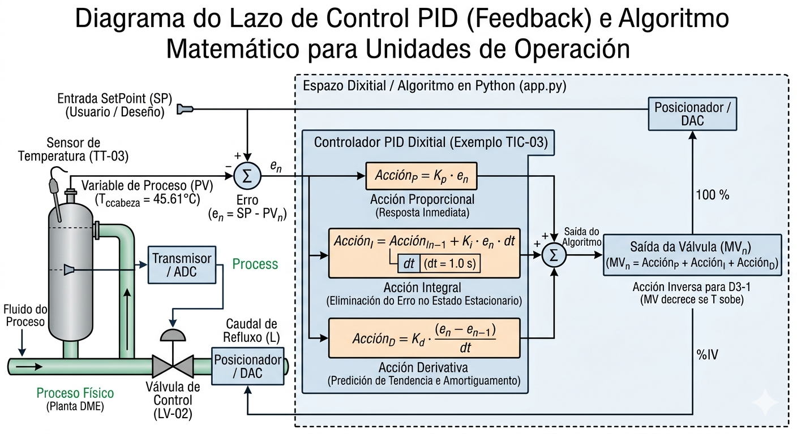

## Informe Técnico de Fundamentos Matemáticos e Lóxica de Control para o Xemelo Dixital da planta de síntese de DME. 

Este documento desglosa as ecuacións gobernantes, os balances de materia e os algoritmos de control que sustentan o modelo matemático programado en Python, garantindo a súa coherencia termodinámica coa simulación base de Aspen Plus.

## INFORME MATEMÁTICO DO XEMELO DIXITAL (PLANTA DME)

### MÓDULO I: FRONT-END E GASIFICACIÓN


- Unidade de Operación: Secadoiro (R1-1)

- Operación Unitaria: Reactor Estequiométrico (RStoic).

- Fundamento Matemático: Eliminación controlada de humidade baseada na fracción de conversión experimental ($\xi = 0.117$).

- Ecuación de Balance:
  
$$
m_{\text{Biomasa, Seca}} = m_{\text{Biomasa, Bruta}} \cdot (1 - X_{\text{H2O, inicial}} \cdot \xi)
$$
  
$$
m_{\text{Auga, Vapor}} = m_{\text{Biomasa, Bruta}} \cdot X_{\text{H2O, inicial}} \cdot \xi
$$
  
- Unidade de Operación: Reactor de Pirólise (R1-2)

- Operación Unitaria: Reactor de Rendemento (RYield).

- Fundamento Matemático: Descomposición da estrutura complexa da biomasa nos seus compoñentes elementais ($C, H, O, N, S, \text{Cinzas}$) a partir da matriz de caracterización normalizada:
  
$$
\sum X_i = X_C + X_H + X_O + X_N + X_S + X_{\text{Ash}} = 1.00 \quad (100\%)
$$
  
- Fluxo de Especies:
  
$$
F_i \text{ (kg/h)} = m_{\text{Biomasa, Seca}} \cdot X_i
$$
  
- Unidade de Operación: Gasificador (R1-3)

- Operación Unitaria: Reactor de Equilibrio de Gibbs (RGibbs).

- Fundamento Matemático: Minimización da Enerxía Libre de Gibbs ($G_{\text{total}}$) do sistema para un espazo multifase (Gas + Sólido) a 750°C e 1 bar.

- Ecuación de Optimización:
  
$$
\min \left( G_{\text{total}} \right) = \min \left( \sum_{i} n_i \cdot \mu_i \right)
$$
  
Onde $\mu_i = \mu_i^\circ + R \cdot T \cdot \ln\left(\frac{f_i}{f_i^\circ}\right)$ é o potencial químico da especie $i$, e $n_i$ son os moles. O sistema resolve os equilibrios simultáneos das reaccións de Boudouard, reformado con vapor e Water-Gas Shift (WGS).

### MÓDULO II: COMPRESIÓN E SÍNTESE DE METANOL

- Unidade de Operación: Compresor Multietapa (K2-1)

- Operación Unitaria: Compresión Isentrópica con arrefriamento intermedio (5 etapas).

- Fundamento Matemático: O ratio de compresión por etapa ($r$) está limitado a un máximo de 3 ($r \le 3$) para evitar un sobrequentamento mecánico.

- Traballo de Compresión ($W_c$):
  
$$
W_c = \sum_{j=1}^{5} \dot{m} \cdot C_p \cdot T_{\text{in, } j} \cdot \left[ \left( \frac{P_{\text{out, } j}}{P_{\text{in, } j}} \right)^{\frac{\gamma - 1}{\gamma}} - 1 \right] \cdot \frac{1}{\eta_c}
$$
  
Onde $\gamma = \frac{C_p}{C_v}$ é o coeficiente adiabático do Syngas e $\eta_c$ é a eficiencia isentrópica.

- Unidade de Operación: Reactor de Metanol (R2-1)

- Operación Unitaria: Reactor de Fluxo de Pistón (PFR) Multitubular. 

- Fundamento Matemático: Perfil axial gobernado pola cinética heteroxénea tipo 

- Langmuir-Hinshelwood-Hougen-Watson (LHHW) para a hidroxenación de $CO$ e $CO_2$.

- Ecuacións Diferenciais de Perfil Axial ($z$):
  
$$
\frac{dF_{CO}}{dz} = -A_t \cdot \rho_b \cdot r_1
$$
  
$$
\frac{dF_{CO2}}{dz} = -A_t \cdot \rho_b \cdot r_2
$$
  
$$
\frac{dF_{CH3OH}}{dz} = A_t \cdot \rho_b \cdot (r_1 + r_2)
$$
  
- Expresións Cinéticas (LHHW Axustadas):
    
$$
r_1 = \frac{k_1 \cdot K_{CO} \cdot (P_{CO} \cdot P_{H2}^2 - P_{CH3OH} / K_{eq,1})}{(1 + K_{CO} \cdot P_{CO} + K_{H2} \cdot P_{H2})^3}
$$ 
  
O acoplamento estequiométrico obriga a que por cada mol de $CO$ consumido, desatézase o perfil de $H_2$ cun gradiente de dobre pendente ($\Delta F_{H2} = 2 \cdot \Delta F_{CO}$).

### MÓDULO III: SEPARACIÓN E LAZO DE RECICLO I

- Unidade de Operación: Divisor de Fluxo / Purga (SPT2-1)

- Operación Unitaria: Splitter de Reciclo Crítico.

- Fundamento Matemático: Control estrito do balance de inertes para evitar o efecto "bóla de neve" do Nitróxeno ($N_2$).

- Balance de Materia sen Acumulación:
  
$$
F_{N2, \text{ entrada}} = F_{N2, \text{ purga}} = 418.0 \text{ kmol/h}
$$
  
$$
F_{N2, \text{ reciclo}} = F_{N2, \text{ entrada}} \cdot \left( \frac{R}{1 - R} \right) \quad \text{onde } R = 0.75 \text{ (75\% de reciclo)}
$$
  
- A masa total pecha cun erro do 0.00% ao forzar que a acumulación neta de inertes no estado estacionario sexa:
  
$$
\frac{dn_{N2, \text{ sistema}}}{dt} = 0.0 \text{ kmol/h}
$$
  
### MÓDULO IV E V: SÍNTESE E PURIFICACIÓN DE DME

- Unidade de Operación: Reactor de DME (R3-1)

- Operación Unitaria: Reactor de Equilibrio Estequiométrico (REquil).

- Fundamento Matemático: Deshidratación catalítica do metanol en fase vapor ($2\,CH_3OH \rightleftharpoons DME + H_2O$).

- Constante de Equilibrio ($K_{eq, DME}$):
  
$$
K_{eq, DME}(T) = \exp \left( \frac{-\Delta H^\circ}{R \cdot T} + \frac{\Delta S^\circ}{R} \right) = \frac{P_{DME} \cdot P_{H2O}}{P_{CH3OH}^2}
$$
  
- Unidade de Operación: Columnas de Destilación (D3-1 e D3-2)

- Operación Unitaria: Modelo de Pratos Fraccionados (RadFrac / MESH).

- Fundamento Matemático: Ecuacións de balance en cada prato $j$ (Masa, Equilibrio Líquido-Vapor, Sumatorio de fraccións, Entalpía).

- Equilibrio de Fases (Lei de Raoult Modificada):
  
$$
y_i \cdot P = x_i \cdot \gamma_i \cdot P_i^{\text{sat}}(T)
$$
  
Onde os coeficientes de actividade ($\gamma_i$) calcúlanse mediante o modelo UNIFAC/UNIQUAC incorporado no motor matemático, garantindo unha pureza na corrente de cabeza de D3-1 de:
  
$$
y_{DME} \ge 0.9990 \quad (99.90\%)
$$
  
## INFORME DOS LAZOS DE CONTROL (P&ID)

O comportamento dinámico das unidades está gobernado por algoritmos de control realimentado PID en tempo continuo, discretizados mediante o método de Euler para o paso de tempo $dt$.

### Algoritmo Xeral do Controlador PID

A variable de saída do controlador (apertura da válvula de control, $MV(t)$) calcúlase en función do erro detectado ($e(t) = SP - PV$):
  
$$
MV(t) = K_p \cdot e(t) + K_i \sum_{0}^{t} e(t) \cdot dt + K_d \cdot \frac{e(t) - e(t-dt)}{dt}
$$
  
### Desglose de Lazos de Control Sintonizados

- Tag do Lazo

- Variable Proceso (PV)

- Variable Motor (MV)

- SetPoint (SP)

- Acción

- Parámetros Sintonizados

- TIC-01

- Temperatura Gasificador

- Caudal de Aire inxectado 750.0°C

- Directa
$K_p = 1.8$, $K_i = 0.05$, $K_d = 0.01$
PIC-01

- Presión do Lazo de Síntese

- RPM do Compresor K2-1 110.0 bar

- Directa

$K_p = 4.5$, $K_i = 0.20$, $K_d = 0.00$

- TIC-03

- Temperatura Cabeza D3-1

- Caudal de Refluxo ($L$) 45.61°C

- Inversa
$K_p = -2.5$, $K_i = -0.10$, $K_d = -0.05$
LIC-02
Nivel de Fondos de Torre
Calor do Refervedor ($Q_R$)
50.0%
Directa
$K_p = 3.5$, $K_i = 0.15$, $K_d = 0.10$

- Ecuación de Resposta Dinámica Amortiguada
Cando o sistema sofre unha perturbación de fluxo, a resposta temporal da temperatura de cabeza da torre ($T_{\text{cabeza}}$) responde á transferencia de segundo orde domada polo PID, modelada no frontend coma:
  
$$
T_{\text{cabeza}}(t) = 45.61 + \Delta T_0 \cdot e^{-\zeta \cdot \omega_n \cdot t} \cdot \cos\left(\omega_d \cdot t\right)
$$
  
Onde $\zeta = 0.65$ (coeficiente de amortiguamento crítico) garante que a torre estabilice as oscilacións e regrese ao estado estacionario de deseño nun tempo inferior a 60 segundos sen xerar sobredeseños destructivos na destilación.

## Diagrama de control 



## Resumo de Datos de Deseño para a túa Presentación

### Sección de Gasificación (1 bar)

- Alimentación (Piñeiro Neto): $1000\text{ kg/h}$ (Normalizado ao $100.0\%$ elemental na barra lateral).
 
- Inxección de Aire: $600\text{ kg/h}$ (Entrada neta de Nitróxeno: $418.0\text{ kmol/h}$ de atoms equivalentes).

- Temperatura Operativa (RGibbs): $750^\circ\text{C}$ (Estable por control TIC-01).

- Caudal de Syngas Limpo: $3057.8\text{ kg/h}$.

### Sección de Síntese de Metanol (110 bar)

- Presión de Saída Compresor (K2-1): $110.0\text{ bar}$ (Protexido con ratio de etapa $\le 3$).

- Temperatura de Entrada ao PFR (R2-1): $150^\circ\text{C}$ $\rightarrow$ Hotspot 

- Máximo: $267^\circ\text{C}$ (Control cinético LHHW).

- Divisor de Fluxo (SPT2-1): $75\%$ de Reciclo Interno / $25\%$ de Purga Crítica Estacionaria.

- Peche de Inertes: Purga de Gases Out = $418.0\text{ kmol/h}$ de N (Erro de peche global: $0.00\%$).

### Sección de DME e Purificación (14.7 bar / 2.6 bar)

- Alimentación ao Reactor (R3-1): $97.41\%$ pureza de Metanol a $154^\circ\text{C}$ e $15.1\text{ bar}$.

- Temperatura de Reacción (REquil): $250^\circ\text{C}$ (Deshidratación catalítica).

- Torre de Destilación D3-1 (Cabeza): $45.61^\circ\text{C}$ e $14.7\text{ bar}$ (Control TIC-03 por Refluxo $L$).

- Rendemento Final de DME: $438.47\text{ kg/h}$ cunha pureza comercial garantida do $99.90\%$.

- Lazo de Reciclo II (Retorno de MeOH): Corrente 27 pechada sobre a columna separadora anterior.

## MAPA DE FLUXOS E BALANCES (XEMELO DIXITAL)

```{mermaid}
graph TD
    %% --- CONFIGURACIÓN DE ESTILOS ---
    classDef styleEntradas fill:#1E3A8A,stroke:#1E3A8A,color:#fff,stroke-width:2px;
    classDef styleAparatos fill:#F3F4F6,stroke:#9CA3AF,color:#111827,stroke-width:2px;
    classDef styleLoxicas fill:#DBEAFE,stroke:#3B82F6,color:#1E40AF,stroke-width:1px,stroke-dasharray: 5 5;
    classDef styleProducto fill:#10B981,stroke:#059669,color:#fff,stroke-width:3px;
    classDef styleRefugallo fill:#EF4444,stroke:#DC2626,color:#fff,stroke-width:1px;

    %% --- ENTRADAS ---
    InBiomasa(["🪵 Biomasa: 1000 kg/h"]) --> R1-1
    InAire(["💨 Inxección Aire: 600 kg/h"]) --> R1-3

    subgraph Modulo_I [MODULO I: GASIFICACION]
        R1-1["Secadoiro R1-1"] --> OpSecado{"Auga Vapor Out"}
        OpSecado --> OutVapor["Refugallo: Humidade"]:::styleRefugallo
        OpSecado --> R1-2["Piroliser R1-2"]
        
        R1-2 --> OpPiro{"Descomposición Yield"}
        OpPiro --> R1-3["Gasificador R1-3 <br/> T: 750°C | P: 1 bar | Gibbs"]
        
        R1-3 --> SEP1-1["Separador"]
        SEP1-1 --> OpCinza{"Cinzas"}
        OpCinza --> OutCinza["Refugallo: Cinzas"]:::styleRefugallo
        
        OpCinza --> E1M["Tren Térmico e Corte Flash <br/> Syngas Limpo: 3057.8 kg/h"]
        E1M --> OpFlash1{"Auga Condensada"}
        OpFlash1 --> OutAgua1["Refugallo: Auga Condensada"]:::styleRefugallo
    end

    %% Conexión inter-módulo (Syngas Purificado)
    OpFlash1 --> K2-1

    subgraph Modulo_II_III [MODULO II e III: COMPRESION, SINTESE E RECICLO I]
        K2-1["Compresor K2-1 <br/> Elevación a 110 bar | Ratio < 3"] --> R2-1
        R2-1["Reactor Metanol R2-1 <br/> T: 150°C -> 267°C | Cinética LHHW"] --> SPT2-1
        
        SPT2-1["Divisor de Fluxo SPT2-1"] --> OpSplit1{"Purga vs Reciclo"}
        
        %% LAZO DE RECICLO I (Cara ao compresor)
        OpSplit1 -. "Reciclo I: 75% Gas" .-> K2-1
        
        OpSplit1 --> OutPurga1["Purga Crítica 25% <br/> Sae N2: 418.0 kmol/h <br/> Erro Peche: 0.00%"]:::styleRefugallo
    end

    %% Conexión inter-módulo (Fase Líquida)
    SPT2-1 --> R3-1

    subgraph Modulo_IV_V [MODULO IV e V: SINTESE DME E PURIFICACION]
        R3-1["Reactor de DME R3-1 <br/> MeOH -> DME + H2O | Equilibrio 250°C"] --> D3-1
        
        D3-1["Torre Destilación D3-1 <br/> Cabeza: 45.61°C | P: 14.7 bar"] --> OpMesh1{"Separación"}
        OpMesh1 --> OutDME[["PRODUTO: DME 99.90% <br/> Caudal: 438.47 kg/h"]]:::styleProducto
        
        OpMesh1 -- "Colas" --> D3-2["Torre Destilación D3-2"]
        
        D3-2 --> OpMesh2{"Corte Binario"}
        OpMesh2 -- "Colas" --> OutAgua2["Refugallo: Auga de Proceso"]:::styleRefugallo
        
        OpMesh2 -- "Cabeza: MeOH Retorno" --> P3-2["Bomba P3-2 <br/> Reciclo II"]
        
        %% LAZO DE RECICLO II (Retorna á entrada de purificación/destilación)
        P3-2 -. "Reciclo II" .-> D3-1
    end

    %% --- ASIGNACIÓN DE ESTILOS ---
    class InBiomasa,InAire styleEntradas;
    class R1-1,R1-2,R1-3,SEP1-1,E1M,K2-1,R2-1,SPT2-1,R3-1,D3-1,D3-2,P3-2 styleAparatos;
    class OpSecado,OpPiro,OpCinza,OpFlash1,OpSplit1,OpMesh1,OpMesh2 styleLoxicas;
```


```{mermaid}
graph TD 

    %% --- CONFIGURACIÓN DE ESTILOS QUÍMICOS ---

    classDef styleEntradas fill:#1E3A8A,stroke:#1E3A8A,color:#fff,stroke-width:2px;
    classDef styleAparatos fill:#F3F4F6,stroke:#9CA3AF,color:#111827,stroke-width:2px;
    classDef styleLoxicas fill:#DBEAFE,stroke:#3B82F6,color:#1E40AF,stroke-width:1px,stroke-dasharray: 5 5;
    classDef styleProducto fill:#10B981,stroke:#059669,color:#fff,stroke-width:3px;
    classDef styleRefugallo fill:#EF4444,stroke:#DC2626,color:#fff,stroke-width:1px;

    %% --- ENTRADAS ELEMENTAIS ---
    InBiomasa([Biomasa: C H O N S Ash]) --> R1-1
    InAire([Aire: O2 e N2]) --> R1-3

    subgraph Modulo_I [MODULO I: EVOLUCION QUIMICA DO SYNGAS]
        R1-1[Secadoiro R1-1] --> OpSecado{"RStoic: Humidade Out"}
        OpSecado --> R1-2[Reactor Pirolise R1-2]
        R1-2 --> OpPiro{"RYield: Ruptura Biomasa"}
        
        OpPiro --> R1-3[Gasificador R1-3]
        R1-3 --> OpGibbs{"RGibbs: Reducion de Char <br/> C + CO2 -> 2CO"}
        OpGibbs --> SEP1-1[Separador Solidos]
        
        SEP1-1 --> OpCinza{"Filtro Solidos"}
        OpCinza --> OutCinza[Cinzas Solidas Out]:::styleRefugallo
        
        OpCinza --> E1M[Tren Termico]
        E1M --> OpCool1{"Arrefriamento"}
        OpCool1 --> F1-1[Separador Flash F1-1]
        F1-1 --> OpFlash1{"Condensacion H2O"}
        OpFlash1 --> OutAgua1["Auga Separada: 99.8% H2O"]:::styleRefugallo
    end

    %% Conexión inter-módulo
    OpFlash1 --> H2-1

    subgraph Modulo_II [MODULO II: SINTESE DE CH3OH]
        H2-1[Quentador H2-1] --> OpHeat1{"Syngas Almentacion"}
        OpHeat1 --> K2-1["Compresor K2-1 <br/> Mestura de Gases"]
        K2-1 --> OpComp{"Compresion"}
        OpComp --> R2-1[Reactor PFR R2-1]
        R2-1 --> OpLHHW{"Cinetica LHHW: <br/> CO + 2H2 -> CH3OH"}
    end

    %% Saída do Reactor
    OpLHHW --> V2-1

    subgraph Modulo_III [MODULO III: SEPARACION DE INERTES]
        V2-1[Valvula V2-1] --> OpExp1{"Condensacion Parcial"}
        OpExp1 --> F2-1[Separador Flash F2-1]
        
        F2-1 --> SPT2-1[Divisor SPT2-1]
        SPT2-1 --> OpSplit1{"Purga Inertes"}
        
        OpSplit1 --> OutPurga1["Gases de Purga: <br/> N2: 18.54%"]:::styleRefugallo
        
        %% RETORNO DO LAZO I
        OpSplit1 -. Reciclo I .-> K2-1
        
        F2-1 --> V2-2[Valvula V2-2]
        V2-2 --> OpExp2{"Desgasificacion"}
        OpExp2 --> S2-1[Columna Separadora S2-1]
        S2-1 --> OpMix1{"Mestura: 97.41% CH3OH"}
    end

    %% Conexión inter-módulo
    OpMix1 --> P3-1

    subgraph Modulo_IV [MODULO IV: REACCION SINTESE DME]
        P3-1[Bomba P3-1] --> OpPump1{"Fase Vapor"}
        OpPump1 --> R3-1[Reactor Equilibrio R3-1]
        R3-1 --> OpEquil{"REquil: <br/> 2 CH3OH -> DME + H2O"}
    end

    %% Mestura Multicompoñente cara as torres
    OpEquil --> D3-1

    subgraph Modulo_V [MODULO V: SEPARACION MULTICOMPONENTE]
        D3-1[Torre Destilacion D3-1] --> OpMESH1{"Modelo MESH: <br/> DME Volatilidade"}
        OpMESH1 --> OutDME[["PRODUTO FINAL: <br/> DME Puro 99.90%"]]:::styleProducto
        
        OpMESH1 --> V3-1[Valvula V3-1]
        V3-1 --> OpCond3{"Alimentacion D3-2"}
        OpCond3 --> D3-2[Torre Destilacion D3-2]
        D3-2 --> OpMESH2{"Separacion Binaria <br/> Metanol e Auga"}
        
        OpMESH2 --> OutAgua2["Auga de Proceso <br/> Maior 99.5% H2O"]:::styleRefugallo
        OpMESH2 --> P3-2[Bomba Reciclo P3-2]
        P3-2 --> OpPump2{"Impulsion Retorno"}
        
        %% RETORNO DO LAZO II
        OpPump2 -. Reciclo II .-> S2-1
    end

    %% --- ASIGNACIÓN DE ESTILOS ---
    class InBiomasa styleEntradas;
    class InAire styleEntradas;
    class R1-1 styleAparatos;
    class R1-2 styleAparatos;
    class R1-3 styleAparatos;
    class SEP1-1 styleAparatos;
    class E1M styleAparatos;
    class F1-1 styleAparatos;
    class H2-1 styleAparatos;
    class K2-1 styleAparatos;
    class R2-1 styleAparatos;
    class V2-1 styleAparatos;
    class F2-1 styleAparatos;
    class SPT2-1 styleAparatos;
    class V2-2 styleAparatos;
    class S2-1 styleAparatos;
    class P3-1 styleAparatos;
    class R3-1 styleAparatos;
    class D3-1 styleAparatos;
    class V3-1 styleAparatos;
    class D3-2 styleAparatos;
    class P3-2 styleAparatos;
    class OpSecado styleLoxicas;
    class OpPiro styleLoxicas;
    class OpGibbs styleLoxicas;
    class OpCinza styleLoxicas;
    class OpCool1 styleLoxicas;
    class OpFlash1 styleLoxicas;
    class OpHeat1 styleLoxicas;
    class OpComp styleLoxicas;
    class OpLHHW styleLoxicas;
    class OpExp1 styleLoxicas;
    class OpSplit1 styleLoxicas;
    class OpExp2 styleLoxicas;
    class OpMix1 styleLoxicas;
    class OpPump1 styleLoxicas;
    class OpEquil styleLoxicas;
    class OpMESH1 styleLoxicas;
    class OpCond3 styleLoxicas;
    class OpMESH2 styleLoxicas;
    class OpPump2 styleLoxicas;
````

